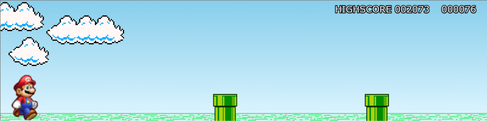

  

  
  
  
  

# Mario 'Dino' Game

Mario 'Dino' Game is an game like the Dinossaur Game from Chrome but with Mario and Pipes.

## Objective
- Mario should avoid obstacles and stay alive.

## Specifications

Game developed with Javascript, CSS and HTML.

## How to use

1. Download the project and run index.html or play [here](https://edtonatto.github.io/mario-dino-game/).
